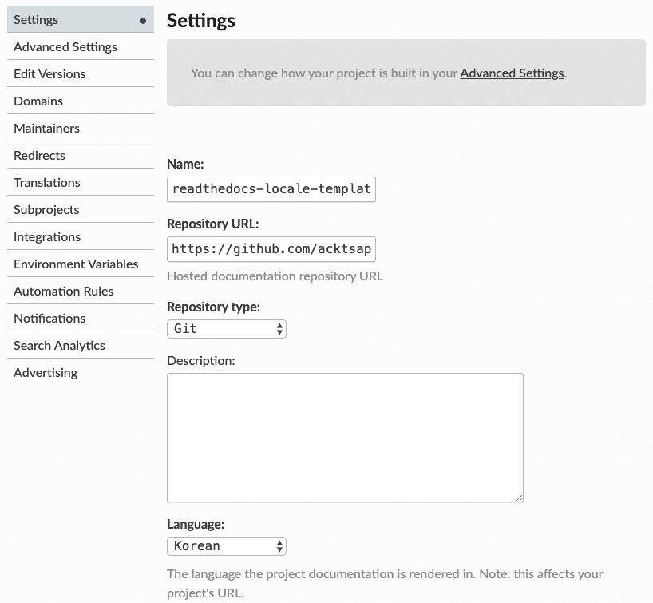
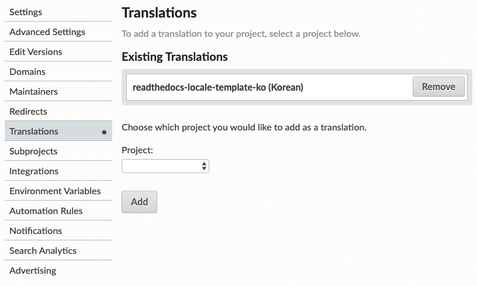

# Sphinx & readthedocs Template

## Usage

- Prepare locale
  - make locale
- Make docs
  - make all
  - make en
  - make ko
- Clean
  - make clean

## Getting Started

Install sphinx, sphinx transaction

```sh
> pip install sphinx
> pip install sphinx-intl
```

Init

```sh
> cd docs
> sphinx-quickstart
```

Make html

```sh
> make html
```

## Read the Docs

[Read the Docs](https://readthedocs.org/dashboard/) provides free hosting for open-source project. For multi-language project, you need translation project for each language. For example, if you have 2 languages (english as base, korean as translation). You have to make two projet

- {project_name}
- {project_name}_ko

Set language for each project in `Admin -> Settings -> language`



And in the base project, add translation.



Then you can find translation.


## References

Official

https://www.sphinx-doc.org/en/master/

Internalization

https://www.sphinx-doc.org/en/master/usage/advanced/intl.html

https://docs.readthedocs.io/en/stable/localization.html

reStructuredText

https://www.sphinx-doc.org/en/master/usage/restructuredtext/index.html

https://docutils.sourceforge.io/docs/user/rst/quickref.html

Read the Docs Build process

https://docs.readthedocs.io/en/stable/builds.html#understanding-what-s-going-on
